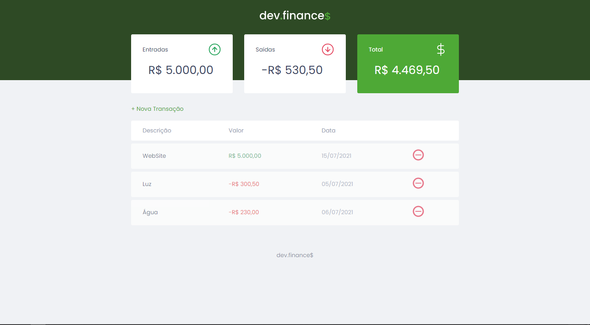
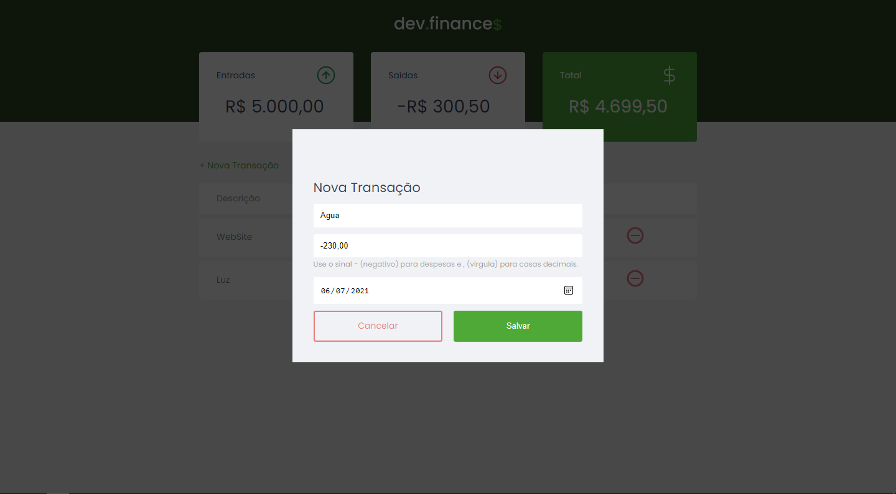

# Página Web com EJS (HTML inteligente)

<a href="https://developer.mozilla.org/pt-BR/docs/Web/HTML" target="blank"></a> <a href="https://developer.mozilla.org/pt-BR/docs/Web/CSS" target="blank"></a> <a href="https://developer.mozilla.org/pt-BR/docs/Web/JavaScript" target="blank"></a> <a href="https://www.codewars.com/users/Victor%20Hugo%20da%20Silva" target="blank"></a>

Essa página web foi produzida com auxílio da maratona discover [Edição 01: DevFinances](https://app.rocketseat.com.br/discover) da Rocketseat. Na série de vídeos é abordado conceitos de HTML semântico, css moderno e JavaScript. O projeto foi desenvolvido com intuito de aprimorar aquilo que foi visto nas trilhas da rocketseat, e basicamente essa página faz a entrada de dados do usuário para gerenciar transições e retornar o valor total do usuário, separando em ganhos e despesas. Todos os dados são armazenados no localstorage, assim, mesmo o navegador sendo fechado, os dados continuarão lá, como estavam na última requisição.

#### Status do Projeto

**🚀 Finalizado**

## Pré-requisitos

Para executar essa projeto será necessário você seguir alguns passos para não ocorrer nenhum erro. Primeiramente, você tem que ter instalado na sua máquina o [Git](https://git-scm.com/) para fazer a clonagem do projeto para sua máquina.

Agora faça um git clone usando o comando:

```bash
git clone https://github.com/VictorSilva15/maratona_discover_dev.finances.git
```

Se quiser modificar o código será necessário um editor de códigos de sua preferência. Recomendo usar o [Visual Studio Code](https://code.visualstudio.com/download)</a>.

## Demonstração

- Layout Principal
  

- Inserindo Dados
  

- Versão Mobile
  

## Como usar

Para usar essa aplicação basta dar um duplo clique no arquivo `index.html`, que a página será aberta no navegador padrão de seu computador.

### 🛠 Tecnologias

As seguintes ferramentas foram usadas na construção do projeto:

- [HTML](https://developer.mozilla.org/pt-BR/docs/Web/HTML)
- [CSS](https://developer.mozilla.org/pt-BR/docs/Web/CSS)
- [JavaScript](https://developer.mozilla.org/pt-BR/docs/Web/JavaScript)

---

## 💪 Como contribuir para o projeto

1. Faça um **fork** do projeto.

2. Crie uma nova branch com as suas alterações: `git checkout -b my-feature`

3. Salve as alterações e crie uma mensagem de commit contando o que você fez: `git commit -m "feature: My new feature"`

4. Envie as suas alterações: `git push origin my-feature`

> Caso tenha alguma dúvida confira este [guia de como contribuir no GitHub](./CONTRIBUTING.md)

---

### Autor


<sub><b>Victor Hugo</b></sub>🚀

Feito com dedicação por Victor Hugo da Silva 👋🏽 Entre em contato!

---

[](https://www.linkedin.com/in/victor-silva-9485021b2/)

[](mailto:victor470hugo@gmail.com)
